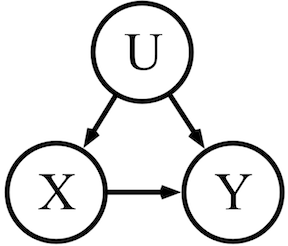
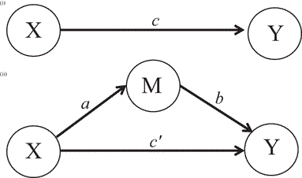
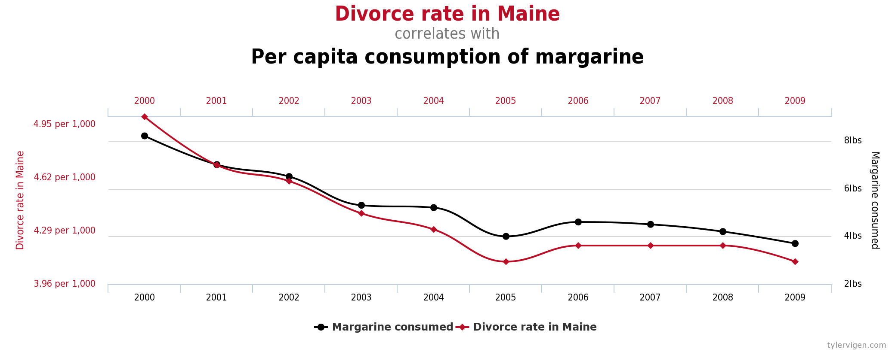
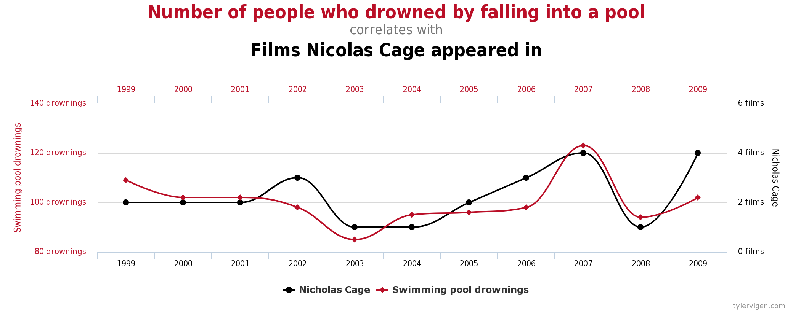

<style>
div.blue pre { background-color:lightblue; }
div.blue pre.r { background-color:cornsilk; }
</style>
<div class = "blue">
```{r setup, include=FALSE}
knitr::opts_chunk$set(echo = TRUE)
```

Today's Lecture:

* Statistical Inference

* Correlation vs. Causation

Now we're moving from answering descriptive questions about what's *in* the data to questions about *why*. It is important to understand what your data can and can't tell you, and what additional data you would need to answer questions that data people often get. Your job is not to be a statistician - your company would have hired a Statistics PhD if so. Your job is to have enough of an understanding of the principles to know how and when to apply them, and be able to explain your results.

### Statistical Inference ###

R was originally built by statisticians, so it a great deal of functionality for working with stats - probably more than you'll ever need. The difference between descriptive statistics and inferential statistics is that descriptive statistics solely describe the properties of the data you have, whereas inferential statistics seek to *infer* properties of a population under the assumption that the data you have is a sample of that population.
```{r, include = F}
library(lubridate)
library(psych)
```

When you have observation data, and you are using it to infer something about the general population you cannot know for certain, you are testing a hypothesis. The null hypothesis you are testing against is the default position, eg, there is *nothing* significantly different happening, or there is *no* relationship between variables. The alternative hypothesis (ie, a theory that you or someone else has) is that something significantly different *is* happening.

For example, imagine someone tells you that the average height of a group of people in a room you cannot observe is 6 feet tall, and the first person that walks out of the room is 5'8". Do you no longer believe their claim? It's only one observation after all, and there's likely a distribution of heights in the room that you can't observe. Perhaps the person you observed was just one of the people shorter than average?
```{r, echo = F}
height <- seq(5, 7, length = 1000)
density <- dnorm(height, mean = 6, sd = 0.33)
plot(height, density, type = 'l')
abline(v = 5.667, col = "red")
```

It's possible that person (the red line above) belongs to a distribution of heights where the average is 6 feet. But you can't see the whole distribution, just the red line. If two more people walk out of the room and their heights are 5'6" and 5'10", now you might be really suspicious about whether the declared mean of 6 feet is accurate. You develop an *alternate hypothesis* that the mean of heights is not 6 feet.

##### One-Sample Tests of Population Mean #####
Your hypothesis test will tell you whether or not you can reject the null hypothesis, and with what degree of confidence. To construct a hypothesis test in this case, you need:

* Sample mean

* Stated value

* Sample standard deviation

* Sample size

We have, or we can calculate, all of those values.

Note: We are making an assumption here that the distribution of heights is normal, which is commonly assumed when we can't observe the real distribution. At the heart of this assumption is the central limit theorem, which gets us to the expectation that quantities we expect to be the sum of several independent processes approach normal. We won't spend much time in this course defining normal distributions and why they are so useful, but I encourage you to look into it on your own. 
```{r}
obs <- c(5.5, 5.6667, 5.8333) # Heights of 5'6", 5'8", and 5'10"
sample_mean <- mean(obs)
stated_value <- 6
sample_std_dev <- sd(obs)
sample_size <- length(obs)
```
From there, you calculate your "test statistic," or `t` which isn't easily interpretable, but essentially is a value that defines the relationship between your sample and the null hypothesis.

    `t` = (sample mean - hypothesized value)/(sample standard deviation/sqrt(sample size))

```{r}
# Calculating our test statistic, or 't'

t_stat <- (sample_mean - stated_value)/(sample_std_dev/sqrt(sample_size))
```
The test statistic increases as the difference between the sample mean and the stated value increases. It decreases as the variance of the sample increases. And it increases as the sample size increases. 

From this statistic, you can calculate a statistic more interpretable: *p-value*. You can interpret p-value as the likelihood that the null hypothesis is true, and that your observations being different is the product of chance. You can also invert the p-value, ie, subtract it from 1, to get your level of confidence in rejecting the null hypothesis. Generally, you want *at least* 95% confidence to consider a result statistically significant.

If your alternate hypothesis is that a mean is *not equal* to a number (as opposed to greater or less than a number), you use a **two-tailed test**. You can remember this by knowing that you could reject the null if the true mean were on either of two sides (greater than **or** less than) of the stated value. The `pt` function converts the t-statistic (along with the sample size) into the p-value. In this case you'll multiply it by 2 because of the two tails.
```{r}
# Calculating two-tailed p-value

pval <- 2 * pt(t_stat, df = sample_size - 1)
pval
```
P-value of 0.07 tells you that there's a 7% chance that the difference we observed between the stated value ("the average height of people in that room is 6 feet tall") and what we saw (three people with heights 5'8", 5'6", and 5'10") was due to random chance. We are 93% confident that the mean is *not* 6 feet, but since we normally consider 95% confidence to be the cutoff, we **cannot reject the null hypothesis.** 

This result seems strange because 93% is a fairly high amount of confidence to have in anything. But keep in mind that we are not making a prediction (whether it will rain tomorrow or who will win the election), we are trying to understand a distribution. If the stated claim has merit, we want to be certain before rejecting it, and there's a 7% chance that the claim is correct *even given what we saw*. 7% is 1 in 14, which is too frequent, or too likely, to give you enough confidence to reject the null.

A shortcut to get these values is the `t.test` function. Here you need to put in your vector of values, whether the test is two-tailed ("two-sided" in this function), and the stated value.
```{r}
t.test(obs, alternative = "two.sided", mu = 6)
```
We can see what happens to our tests if have more observations and/or more variance.
```{r}
# Increase the variance
obs <- c(5.4, 5.6667, 5.9333) # Now the observed heights are 5'5", 5'8", and 5'11"
t.test(obs, alternative = "two.sided", mu = 6)
# Increase the number of observations

obs <- c(5.5, 5.6667, 5.8333, 5.45, 5.6667, 5.87)
t.test(obs, alternative = "two.sided", mu = 6)
```

If the stated claim were less specific, and only that the average height is 6 feet or greater, you would use a more specific alternate hypothesis. Your alternate hypothesis would then be that the actual mean is *less than* 6 feet. In a case like this (ie, alternate hypothesis greater than or less than), you use a one-tailed t-test. Before calculating, what does your intuition say? Will this null hypothesis be easier or more difficult to reject? Is your alternate hypothesis more or less specfic?

Again, you can use the `t.test` function (or do it long-hand, like we did above, for conceptual reinforcement).
```{r}
t.test(obs, alternative = "less", mu = 6)
```
A one-tailed test is only testing one direction (less than) so it's easier to find statistical significance. By doing a one-tailed test, we are essentially saying we are 100% confident that the mean isn't *greater* than 6 feet. By removing that half of the distribution, it makes our case easier to make.  Here, we're 97% sure that the true mean is less than 6, and we reject the null hypothesis. 

In general, you should default to two-tailed tests, and only use one-tailed when you are certain that the opposite of your alternate hypothesis is not true. Here's an example where that would come into play: You are trying to decide if you should buy a brand name product or a generic product at your local drugstore. A one-tailed test of the effectiveness of the product would only tell you if the generic product worked better than the brand name. You would have no insight into whether the product was equivalent or worse.

##### Two-Sample Tests of Population Means #####
Instead of evaluating a stated value for a population, you might be analyzing two different populations. For example, if two groups of people were exposed to different policies or products, you might want to know whether those populations varied along the dimension the policy or product change was supposed to impact.

Let's imagine a policy designed to increase the efficiency of public transportation. Specifically, this policy targets on-time arrivals.
```{r}
# Let's simulate some arrival data for a bus scheduled for 8am, for Oct. 1 -5.
  # Assume this is before the policy is implemented
arrival_times <- seq.POSIXt(as.POSIXct("2018-10-01 08:10:00"),
                            as.POSIXct("2018-10-05 08:10:00"), "day") + (rnorm(1:5, sd = 15)) * 60
pre_policy <- data.frame(date = seq.Date(as.Date("2018-10-01"), as.Date("2018-10-05"), "day"), arrival_times = arrival_times)

pre_policy
# The value we are interested in is the difference from the scheduled time (in minutes)
pre_policy$diff <- abs((hour(pre_policy$arrival_times) +
                          minute(pre_policy$arrival_times)/60 +
                            second(pre_policy$ arrival_times)/3600 - 8) * 60)

pre_policy
# The sample average arrival time is a descriptive statistic describing the five data points we have
round(seconds_to_period((mean(hour(pre_policy$arrival_times) +
                          minute(pre_policy$arrival_times)/60 + 
                            second(pre_policy$arrival_times)/3600)) * 3600))
```
Before you have any additional data, you can see if you could conclude that this bus is regularly late or not by testing the sample against the stated value (in this case, 8am).
```{r}
t.test(pre_policy$diff, alternative = "two.sided", mu = 8)
```
But suppose the policy already happened (started on Nov. 1), and now you have data from after the policy change.
```{r}
# Arrival data for a bus scheduled for 8am, for Nov. 1 -5.
arrival_times <- seq.POSIXt(as.POSIXct("2018-11-01 08:03:00"),
                            as.POSIXct("2018-11-05 08:03:00"), "day") + (rnorm(1:5, sd = 10)) * 60
post_policy <- data.frame(date = seq.Date(as.Date("2018-11-01"), as.Date("2018-11-05"), "day"), arrival_times = arrival_times)

post_policy
# The value we are interested in is the difference from the scheduled time (in minutes)
post_policy$diff <- abs((hour(post_policy$arrival_times) +
                          minute(post_policy$arrival_times)/60 +
                            second(post_policy$ arrival_times)/3600 - 8) * 60)

post_policy
# The sample average arrival time is a descriptive statistic describing the five data points we have
round(seconds_to_period((mean(hour(post_policy$arrival_times) +
                          minute(post_policy$arrival_times)/60 + 
                            second(post_policy$arrival_times)/3600)) * 3600))
```
You want to know whether the policy had an impact, so you can test whether there is a statistically significant difference between the means of the two populations. You can do this with a two-sample t-test, which you can run using the `t.test` function.
```{r}
t.test(pre_policy$diff, post_policy$diff)
```
The default for `t.test`, and for two-sample tests in general, is that the samples are *unmatched*, meaning they come from different subjects. However, if both `pre_policy` and `post_policy` are from the same bus line, for example, you use a 'paired' t-test.
```{r}
t.test(pre_policy$diff, post_policy$diff, paired = T)
```
If you are only interested in one possible direction of the policy, you can use a one-tailed test. The approach and caveats are the same as for a one-sample, one-tailed test: you should only use this approach if you are *certain* that the inverse outcome is not possible.

In the case of the bus arrival time policy impact, you could conduct a one-tailed test to see whether `diff` is lower after then policy than before. You do do using the `t.test` function again. Here, the important thing to remember is that you are measuring the difference from the first vector, ie, whether the second vector is less than the first.
```{r}
t.test(pre_policy$diff, post_policy$diff, alternative = "less")
```
What important possibility does this test leave out?

##### ANOVA Hypothesis Test #####
`anova` tests whether means are different across three or more populations, (eg, a category variable). The inputs and outputs are a little different for this function. `anova` is designed to analyze the results of a regression, so you can wrap the function around the `lm` function, where you regress the measure variable you're interested in (y) on the category variable (x).
```{r, include = F}
wine_data <- read.csv("wine_components.csv")
```
```{r}
anova(lm(alcohol ~ wine_type, data = wine_data))
```
`anova` returns an F- statistic (similar to the t-statistic) and a p-value (in the table as `Pr(>F)`). The interpretation of the p-value is the same as with a t-test.

Here is a useful visual about when to use which test:

](lecture_materials/test_stat_guide.gif)

Note: The default for the `t.test` function when evaluating two variables is that their variances are *not* equal. If you have good cause to think that they are, set `var.equal` to `T`.

### Correlation vs. Causation ###

You can calculate the correlation between any two paired sets of numbers with the `cor` function.
```{r}
cor(wine_data$total_phenols, wine_data$flavanoids)
```
This value tells you strong the relationship is between the variation between the two numbers, ie, when one increases, the other does as well. Correlation of 1 indicates perfectly correlated, 0 indicates no correlation, and -1 indicates perfectly negatively correlated. 

Calculating correlation is a good first step to investigating whether there is a relationship between two variables. You can further test this potential relationship with the function `cor.test`, which tests whether the correlation between two variables is statistically significant based on the data you have.
```{r}
cor.test(wine_data$total_phenols, wine_data$flavanoids)
```
Correlation is a good place to start, but you have probably heard the phrase, "correlation is not causation" before. Simply put, just because there appears to be a relationship between two things doesn't mean that one is the reason for the other. This is a surprisingly common misunderstanding. Take our bus arrival policy change. Suppose that three months after the policy were inacted, the difference between scheduled time and arrival time had decreased by 20%. We have enough data to say with a high level of certainty that the observed change is not due to chance. Did the policy change *cause* this improvement to arrival times? Possibly. What else might have happened?

##### Confounding Variables #####
A confounding variable impacts both the independent variable and the dependent variable, so it's impact can be mistaken for the change that we are analyzing. In the case of the bus arrival policy, the policy is the independent variable (a binary variable, 'pre' and 'post') and the arrival times is the dependent variable. What if the season, or time of year, has an impact on bus arrival times? If bus arrival times typically improve in November for whatever reason, it would appear that the policy had caused this change, when in fact the change would have happened with or without the policy.



There is no test in R for confounding variables, but anytime you are examining relationships between two variables, it is important to be aware of other variables that could be affecting both.

##### Mediating Variables #####
A mediating variable is similar to a confounding variable in that it is an unobserved variable and can lead to incorrect conclusions about the relationship between two variables. However, a mediating variable occurs when the relationship between two variables is not direct but involves a third variable, ie, the mediator. For the bus arrival policy example, suppose that the announcement of the policy led several poor-peforming drivers to quit before the policy was enacted? Having fewer bad bus drivers was the mechanism to improve arrival times, *not* the actual policy. Ie, if you enacted the same policy somewhere with fewer bad bus drivers, you would not see the same improvement to arrival times. That is because the improvement was actually mediated by a variable you did not measure.



Again, there is no test for mediating variables, but you need to be aware of their possibility.

##### Random Correlation #####
Random correlations are even harder to spot but important to be aware of. If you have enough variables and enough data, you will eventually find some variables that appear to be strongly correlated but couldn't possibly be related.







Misattributing cause to correlation is called a *spurious* correlation. Hypothesis tests will help you understand the likelihood that the relationship between variables is due to chance, but many things other than chance could be the underlying reason that you see a relationship in the data. You need to be aware of what other factors could be involved.

However, inferring cause after the fact will always be a tall order. You can't know for certain that you have accounted for all the factors that could have affected your outcome variable. That is why running an experiment - where some segment of the population receives the treatment and the other do not - is the gold standard for understanding cause. That's what we'll talk about tomorrow.

#### Acknowledgement ####

This lesson is based in part on:

* [*R Tutorial: An Introduction to Statistics*](http://www.r-tutor.com/elementary-statistics/inference-about-two-populations/population-mean-between-two-matched-samples) by Chi Yau

* [*YaRrr! The Pirate's Guide to R*](https://bookdown.org/ndphillips/YaRrr/) by Nathaniel D. Phillips

* [*PLSC 31101: Computational Tools for Social Science*](https://plsc-31101.github.io/course/) by Rochelle Terman

* [*The Difference Between One-Tailed & Two-Tailed Testing*](https://blogs.oracle.com/marketingcloud/the-difference-between-one-tailed-two-tailed-testing) by Kylie Vallee
</div>