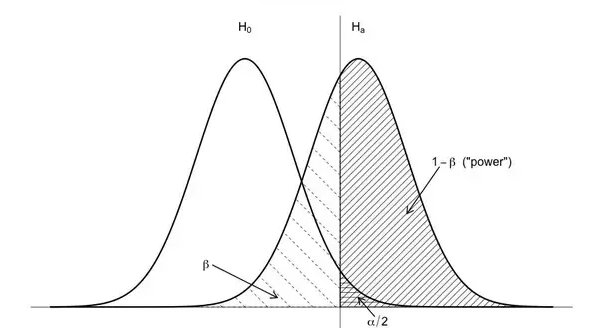

<style>
div.blue pre { background-color:lightblue; }
div.blue pre.r { background-color:cornsilk; }
</style>
<div class = "blue">
```{r setup, include=FALSE}
knitr::opts_chunk$set(echo = TRUE)
```

Today's Lecture:

* Magnitude and Power Analysis

* Building Dynamic Power Analysis

* Constructing Treatment and Control Groups

More and more companies and organizations are using experiments to improve their products and services. A common experiment construction is to make a change for some segment of the population but not for the other population. The group that sees the change is called the 'treatment' group, and the group that doesn't is called the 'control' group. With the assumption that the only difference between the treatment and control groups is the change, any difference in behavior between the two *must* be due to that change. This type of experiment is often the best way to get at what truly *causes* change. 

Designing, running, and evaluating experiments is what puts the 'science' in 'data science.' Before an experiment starts, it is important to define parameters

* What is being tested? (Usually a change to a product, service, or policy)

* What is the intended outcome? (Usually a behavior change)

* How will treatment and control groups be chosen? (Usually a randomized processs)

* What outcome would lead to the conclusion that the treatment is the preferred option?

### Power Analysis and Magnitude ###
##### Magnitude #####
To answer that last question, you need to think about the outcome of the experiment in terms of magnitude. T-tests tell you whether there is a difference between groups, but not the size of the difference. Think of magnitude as the size of the difference, also called the effect size. You calculate the effect size by dividing the difference between the means by the pooled standard deviation. 
```{r}
# Consider two groups: treatment and control (each has standard deviation of ~5)
treatment <- c(84, 88, 93, 95)
control <- c(79, 83, 88, 90)

# Calculate the pooled standard deviation
pooled_sd <- sqrt((sd(treatment)^2 + sd(control)^2)/2)

# Calculate the effect size
(mean(treatment) - mean(control))/pooled_sd
```
Note that effect size is essentially the difference in populations in terms of their standard deviations. So an effect size of 1 means that whatever the distinction there is between treatment and control, its effect is a one standard deviation difference in outcome.
```{r}
library(ggplot2)
# We can construct and plot some sample data that would reflect this effect size
  # Note: we are simulating 100 observations in each group to create the visual, but we actually have only 4 in each
data <- data.frame(outcome = c(rnorm(100, mean = 90, sd = sd(treatment)),
                               rnorm(100, mean = 85, sd = sd(control))),
                   group = rep(c("treatment", "control"), each = 100))

ggplot(data, aes(x = outcome, fill = group)) + geom_density(alpha = 0.5)
```

Effect size and statistical signficance are very different, however. A large effect size from a small sample size will not be statistically significant because the likelihood that the difference is due to chance is too high.
```{r}
t.test(treatment, control)
```
Calculating statistical signficance when evaluating change is important, but the effect size, or magnitude of the change, is nearly as important. If you have large enough sample sizes, you are nearly guaranteed to find statistical significance of *some* change.
```{r}
# Construct a dataset with two large populations that are nearly identical
data <- data.frame(outcome = c(rnorm(10000, mean = 100.1, sd = 0.5),
                               rnorm(10000, mean = 100, sd = 0.5)),
                   group = rep(c("treatment", "control"), each = 10000))

ggplot(data, aes(x = outcome, fill = group)) + geom_density(alpha = 0.5)
# The distributions are nearly overlapped, yet the difference between the two is very strongly statistically significant
t.test(outcome ~ group, data = data)
```
If a company or organization cares enough about making some kind of change that they want to run an experiment, they probably care about the *size* of the impact due to that change, not just whether any impact exists. Changes are often expensive or hard, even if the result is a known quantity, so it is reasonable to ask, 'how much impact would make the change worth implementing?'

Before starting any experiment, you need to decide (probably along with the other stakeholders) what is the effect size we are looking for? Fortunately, once you figure that parameter out, you can answer another important question: How big (or how long) does this experiment need to be?

##### Power Analysis #####
Power analysis defines the relationship between four important parameters in experimental design. If you have three of the parameters established, you can calculate the fourth. Power analysis is most commonly used ahead of an experiment to the calculate the sample size required to detect an effect of a given size with a given degree of confidence. The four parameters involved in power analysis are:

* Effect size: expected effect of the change being tested
  * Determined by previous results, cost-benefit analysis, best educated guess, etc.

* Alpha: probability of finding significance where there is none (called a 'false positive')
  * Equal to 1 - confidence interval
  * Usually set to 0.05
  
* Power: probability of finding true significance (called a 'true positive')
  * Equal to 1 - beta, where beta is the probability of not finding significance when it is there (called a 'false negative')
  * Usually set to 0.8
  
* Sample size: the number of observations in the experiment
  * Usually the parameter you are solving for
  
It is useful to spend a minute here on the concept of 'power,' since the other three parameters are a bit more intuitive. There are two types of errors you generally concern yourself with. A Type I error is finding significance where there is none (ie, false positive). This is a familiar concept because we often hear declarations made, followed by the caveat 'with 95% confidence.' The parameter alpha is the inverse of the confidence interval. Eg, if CI = 95%, alpha = 0.05 A Type II error is not finding significance where it *is* there (ie, false negative). Power is the inverse of probability of a false negative, ie, the probability of a true positive.

Here is a good visual representation of the two concepts together:



Usually power is set at 0.8 and alpha at 0.05, so what you are most interested in are effect size and sample size. You can use power analysis to determine sample size when you have the other three parameters established, which is useful in scoping out the length, size, and/or cost of an experiment.

For power analysis in R, install and load the `pwr` package.
```
install.packages("pwr")
```
```{r}
library(pwr)
```
The `pwr` package has several functions; we'll focus on `pwr.2p.test`, which is a function for an experiment with two proportions of equal size. Give the function three of the power analysis parameters, and it will return the fourth. The `h` argument is effect size, `n` is number of observations per sample, `sig.level` is alpha (default = 0.05), and `power` is power. You also need to provide the type of alternative hypothesis, similar to the `t.test` function.
```{r}
# Imagine we are interested in a large effect size of 0.5
pwr.2p.test(h = 0.5, power = 0.8, alternative = "two.sided")
# If we increase the significance level
pwr.2p.test(h = 0.5, sig.level = 0.01, power = 0.8, alternative = "two.sided")
# If we increase the power
pwr.2p.test(h = 0.5, power = 0.9, alternative = "two.sided")
```
It is important to remember that the `n` output is the number of observations per sample. So if you are estimating the total size of the experiment, you need to multiply by two.

### Building Dynamic Power Analysis ###

Power analysis is useful for planning an experiment because it helps predict the number of observations needed to yield specific results. Because power analysis can return any of the four parameters if you have the other three, it is also useful for evaluating an ongoing experiment. `pwr.2p.test` returns a list, making it easy to extract values to populate a dashboard or visualization.
```{r}
# We can simulate some sequential experiment data and provide updates as the experiment continues
data <- data.frame(n = rep(c(1:10000), 2),
                   outcome = c(rnorm(10000, mean = 104, sd = 5),
                               rnorm(10000, mean = 100, sd = 5)),
                   group = rep(c("A", "B"), each = 10000))
# Write a function to create visual that will update as 'n' increases
experiment_progress <- function(t, pwr = 0.8) {
  # 't' equals time period, so we subset the data by t
  subset <- data[data$n <= t,]
  # Create outcome vectors for each group
  sub_A <- subset$outcome[subset$group == "A"]
  sub_B <- subset$outcome[subset$group == "B"]
  # Create labels for the mean of each group for the visual
  A_mean_label <- paste("mean A group:", round(mean(sub_A), digits = 2))
  B_mean_label <- paste("mean B group:", round(mean(sub_B), digits = 2))
  # Calculate the current effect size and subsequent power
  h <- abs((mean(sub_A) - mean(sub_B))/sqrt((sd(sub_A)^2 + sd(sub_B)^2)/2))
  pwr_stats <- pwr.2p.test(h = h, n = t, alternative = "two.sided")
  # Create labels for current level of power and number of observations still needed to achieve power threshold
  power_label <- ifelse(pwr_stats$power < pwr, 
                        paste("power:", round(pwr_stats$power, digits = 2), "(below threshold)"),
                        paste("power:", round(pwr_stats$power, digits = 2), "(threshold met)"))
  obs_needed_label <- ifelse(pwr_stats$power < pwr,
                             paste("obs still needed:", (round(pwr.2p.test(h = h, power = pwr,
                                                                    alternative = "two.sided")$n) - t) *2),
                             "sufficient observations")
  # Output visualization
  ggplot(subset, aes(x = outcome, fill = group)) + geom_density(alpha = 0.5) +
    xlim(70, 120) + 
    geom_vline(xintercept = mean(sub_A)) + 
    geom_vline(xintercept = mean(sub_B)) + 
    geom_text(aes(70, 0.05, label = A_mean_label), hjust = 0) +
    geom_text(aes(70, 0.045, label = B_mean_label),  hjust = 0) +
    geom_text(aes(70, 0.04, label = paste("total obs:", nrow(subset))),  hjust = 0) +
    geom_text(aes(70, 0.035, label = power_label),  hjust = 0) +
    geom_text(aes(70, 0.03, label = obs_needed_label),  hjust = 0)
}
experiment_progress(10)
experiment_progress(50)
experiment_progress(100)
```


### Constructing Treatment and Control Groups ###
##### Unbalanced Samples #####
The most straight forward approach to selecting treatment and control status (sometimes called 'bucketing') is to randomly assign status in equal proportions. However, if the treatment is expensive or risky, equal proportions might not be ideal. If you plan to have unbalanced groups, you need to use the `pwr.2p2n.test` function to determine your parameters. The difference between this function and `pwr.2p.test` is here you need a separate sample size for both groups. If you already know the size of one of your groups, provide that as argument `n1`.
```{r}
pwr.2p2n.test(h = 0.5, n1 = 1000, power = 0.8, alternative = "two.sided")
# If we expect an effect size of 0.5 and we have 1000 of one sample, we will need approximately 33 observations in the other sample to achieve 80% power.
```
If you are thinking about your samples as proportions of each other (eg, 90%/10%), you can combine the `pwr.2p.test` with the `while` function to determine each group's size. The `while` function is somewhat simlar to `if`:

    while(conditional statment) {command(s)}

`while` takes a conditional statement, and if that statement is `TRUE`, it runs the subsequent commands *until* the statement is no longer true.
```{r}
# 'i' is number of observations in treatment group, i*9 is number in control
  # Start with 2 obs in treatment, 18 in control (10%/90%)
i <- 2
# As long as power is < 0.8, add an additional observation to treatment (i)
while(pwr.2p2n.test(h = 0.5, n1 = i, n2 = i*9)$power < .80) {i <- i + 1}
# Once 80% power is achieved, print group sizes
pwr.2p2n.test(h = 0.5, n1 = i, n2 = i*9)
# If we expect an effect size of 0.5 and we want to have 10% of the total sampled population in one group and 90% in the other, we will need 35 observations in one group and 315 in the other to achieve 80% power.
```
##### Stratified Sampling #####
If within the population you are running your experiment on, there is a characteristic (or multiple characteristics) that could impact the outcome, you might want to make sure that each of your samples is representative of the population according to that characteristic. For example, if you are planning to test a policy change on a population that has both 'urban' and 'rural' constituents, you would want to make sure that each sample reflected those sub-populations in the correct proportions. That process is called *stratifying* your samples. The `dplyr` package has a few useful functions for this. Use the function `group_by` to choose the variable(s) you would like to stratify by. Wrap `sample_frac` around to create your sample.
```{r, include = F}
library(dplyr)
```
```
library(dplyr)
```
```{r}
# We can simulate a population of 1000 that is 70% urban, 30% rural
data <- data.frame(n = c(1:1000), type = c(rep("urban", 700), rep("rural", 300)))

# We want a representative sample of 10% of the population
sample <- sample_frac(group_by(data, type), 0.1)
table(sample$type)
```

The most important takeaway for constructing an experiment is *defining the parameters before beginning the experiment*. The more stakeholders of the experiment who can be brought into the process and bought in on the parameters, the more likely the parameters will be respected throughout.

#### Acknowledgement ####

This lesson is based in part on:

* [*A Researcher’s Guide to Power Analysis*](https://research.usu.edu//irb/wp-content/uploads/sites/12/2015/08/A_Researchers_Guide_to_Power_Analysis_USU.pdf) by Anne Hunt

* [*Getting started with the pwr package*](https://cran.r-project.org/web/packages/pwr/vignettes/pwr-vignette.html)
</dev>