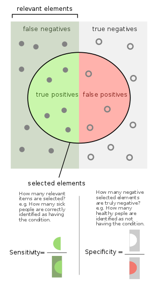
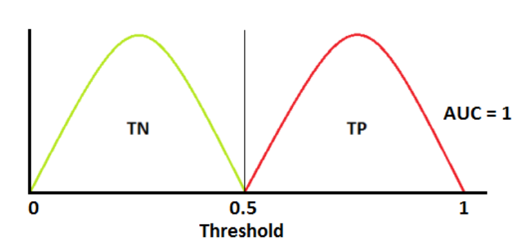
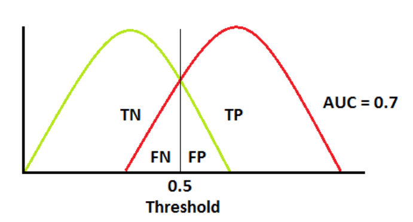

<style>
div.blue pre { background-color:lightblue; }
div.blue pre.r { background-color:cornsilk; }
</style>
<div class = "blue">
```{r setup, include=FALSE}
knitr::opts_chunk$set(echo = TRUE)
```

Today's Lecture:

* Logistic Regression

* Interpreting Results

* Threshold Optimization

* Take Home Exercises for Data Roles

### Logistic Regression ###

If the outcome variable you are modeling is a binary variable (for example, whether or not a borrower defaults), you need the model to produce predicted values that reflect the *probability* that the observation is a 1 (ie, 'true'). There are different approaches for modeling binary variables; logistic regression is one of the most common. 

The approach to building a predictive logistic regression model is the same as for an OLS model, with a few important differences. First, you need to have a binary outcome variable and set `TRUE` values equal to 1 and `FALSE` to 0. Note: Although we won't do so here, logistic regressions can be used for category variables with three or more categories.

```{r}
# Imagine a data set of students' hours spent studying and test score
hrs_studying <- data.frame(hrs = seq(0.5, 5.25, 0.25), 
                           score = c(51, 56, 52, 57, 56, 61, 57, 63, 58, 66, 59, 60, 58, 65, 65, 69, 65, 71, 69, 73))

# Plot the scores against hours studied
library(ggplot2)
ggplot(hrs_studying, aes(x = hrs, y = score)) + geom_point() + 
  geom_smooth(method = 'lm', se = F)
```

Most of the time when you would be modeling a binary outcome variable, there is no observable continuous variable you could model instead. For example, test scores would be better to model than a pass/no pass metric, but many binary variables (fraud/no fraud, etc.) have no similar analog. Because the outcome variable can only be 1 or 0, if you used a simple linear regression the way you would with a continuous variable, the model would produce results that are non-sensical from a probability standpoint.
```{r}
# Now imagine any score 60+ is a passing score
hrs_studying$pass <- ifelse(hrs_studying$score > 59, 1, 0)
head(hrs_studying)
ggplot(hrs_studying, aes(x = hrs, y = pass)) + geom_point() + 
  geom_smooth(method = "lm", se = F)
```

Just like a simple linear regression, the logistic model assumes a linear relationship between the independent variable(s) and the outcome. The difference is that the model uses the logarithm function to calculate the coefficients so that the predicted values are always between 1 and 0.
```{r}
ggplot(hrs_studying, aes(x = hrs, y = pass)) + geom_point() + 
  geom_smooth(method = "glm", method.args = list(family = "binomial"), se = F)
```

To run a logistic regression, use the `glm` function and set the `family` argument to `binomial(link = 'logit')`. Note: you need to remove any observations with `NA` values in order to constrain the model later.
```{r}
model_formula <- as.formula("pass ~ hrs")
hrs_full <- hrs_studying[which(complete.cases(hrs_studying[,all.vars(model_formula)])),]

logit_model <- glm(model_formula, data = hrs_studying, family = binomial(link = "logit"))
summary(logit_model)
```
##### Constraining the Model #####
The `olsrr` package does not work on logit models, so we'll use the `step` function from base R, with `direction` set to `backward`.
```{r}
constrained_logit_model <- step(logit_model, direction = 'backward')
summary(constrained_logit_model)
```

### Interpreting Results ###

The output from the `summary` function will look familiar, and the p-values on the righthand column can be interpreted similarly in terms of statistical significance. The sign of the coeffcient can also be interpreted similarly (eg, a positive coefficient indicates a positive relationship between the independent relationship and the outcome). 

The predicted outcome values are calculated using the logarithmic function, which is non linear. You won't be able to interpret the relationship between the independent variable and the outcome with a statement such as, 'each additional hour of studying increases the likelihood of a student passing by 12%.' In order to calculate the predicted probabilties, you need to do this transformation, which uses the `exp` function (the inverse of `log`):

    probability = 1/(1 + exp(-(Intercept + (variable * coefficient))))
  
```{r}
# Create a table of predicted probabilities for each hour of studying
pred <- data.frame(hours = c(1:5))
pred$probability <- 1/(1 + exp(-(constrained_logit_model$coefficients["(Intercept)"] + 
                                   (pred$hours * constrained_logit_model$coefficients["hrs"]))))
pred
```
Use the same calculation to construct fitted values when you are testing your model.
```{r, include = F}
library(plyr)
library(dplyr)
```
```{r}
pred_probability <- function(data, obs, coefficients) 
  {pred <- rbind.fill(obs[names(data) %in% names(coefficients)],
                      as.data.frame(t(coefficients))) %>% t %>% as.data.frame %>% subset(!is.na(V1))
  pred$product <- pred$V1 * pred$V2
  1/(1 + exp(-(sum(pred$product, unname(coefficients[1])))))
}

# Check function against model's fitted values
i <- 1
pred_probability(hrs_full, hrs_full[i,], constrained_logit_model$coefficients)

constrained_logit_model$fitted.values[i]
```

### Threshold Optimization ###

Logit models provide predicted probabilities, but probabilities are different than an actual prediction about a binary outcome. In order to turn predicted probabilites into predictions, you need to establish a cutoff point, or a threshold. Any predicted probability above the threshold will result in a prediction of 'true,' and below the threshold 'false.' 

The value add of the model comes from it's ability to make accurate predictions, so the establishment of the threshold is important for the model's successful deployment. There are several ways to optimize a model's threshold, depending on, for example, how important avoiding false positives is compared to false negatives. I encourage you to read about 'sensitivity,' 'specificity,' 'precision,' and 'recall' to learn more about the concepts and their tradeoffs. 



Here we'll use the 'F1' statistic to evaluate possible thresholds. F1 considers both 'precision' and 'recall' of a threshold. 'Precision' is the number of true positives divided by the number of 'true' predictions made, and 'recall' is the number of true positives divided by the total number of observations that were actually 'true.'

    F1 = 2 * ((precision * recall)/(precision + recall))
    
The best possible F1 score is 1 and the worst is 0. The threshold with the highest F1 value is the most accurate way to use the model.
```{r}
# Establish possible thresholds
thresh <- data.frame(threshold = seq(0, 1, 0.01))

# Add predicted values to initial dataframe
hrs_full <- data.frame(hrs_full, pred = constrained_logit_model$fitted.values)

thresh$precision <- apply(thresh, 1, function(x) {sum(hrs_full$pred > x &
                                                 hrs_full$pass == 1)/sum(hrs_full$pred > x)})

thresh$recall <- apply(thresh, 1, function(x) {sum(hrs_full$pred > x &
                                                 hrs_full$pass == 1)/sum(hrs_full$pass == 1)})

thresh$F1 <- 2 * ((thresh$precision * thresh$recall)/(thresh$precision + thresh$recall))
thresh[which.max(thresh$F1),]
best_thresh <- thresh[which.max(thresh$F1), "threshold"]
```

Now that you have an optimized threshold, you can use the model to create predictions and evaluate the success of those predictions. Just as you would with a simple linear regression, you can compare the performance of the model on training data to that on the test data. The way to compare logit model performance is different that for simple linear regression. Again, there are many techniques, but we'll use AUC (Area Under the Curve) here. Briefly, the AUC metric represents how capable the model (and accompanying threshold) is at distinguishing between 'true' and 'false.' Similar to the F1 statistic, AUC values can be between 0 and 1, with values nearer to 1 reflecting a model that does a good job of distinguishing. An AUC of 0.5 means the model's prediction has the same accuracy as random chance.





You can use the `AUC` function from the `cvAUC` package to calculate the metric for a set of predictions and actual values. 

```{r, include = F}
library(cvAUC)
```
```{r}
AUC(ifelse(hrs_full$pred > best_thresh, 1, 0), hrs_full$pass)
```

### Take Home Exercises for Data Roles ###

Many data science and data analysis positions will ask candidates to complete a take home exercise as part of the hiring process. In my experience, the exercise will usually contain:

* Dataset(s)

* Data description/data dictionary

* Assignment parameters: 

  * Questions to answer
  
  * Approaches to consider
  
  * Expected deliverables
  
  * Time constraint
  
Here is an example:

    Data Science Interview Challenge:

    The goal of this challenge is to produce a sample of your machine learning skills as well as your ability to write clean, readable, and well-documented code.

    Problem Statement

    You will use credit card transaction data to detect fraud. Fraud can take many forms, whether it is someone stealing a single credit card, to large batches of stolen credit card numbers being used on the web, or even a mass compromise of credit card numbers stolen from a merchant via tools like credit card skimming devices. Note that this dataset loosely resembles real transactional data, but the entities and relations within are purely fictional.

    Please complete the following tasks:

	1.	Programmatically download the data from [location withheld]
	
	2.	Briefly describe the data structure, provide summary statistics, and at least one plot.
	
	3.	Build a model to determine whether a given transaction is fraudulent or not. Each of the transactions in the dataset has a field called isFraud.
	
	  ◦	Hint: This task should involve some feature engineering although it can be limited.
	  
	4.	Provide an evaluation of model performance.
	
	5.	Document your solution.
	
	  ◦	Hint: Documentation should include:
	  
	    ▪	Assumptions about the data
	    
	    ▪	Explanations of methods i.e. algorithm used and why, what features were important, and any alternative methods considered
	    
	    ▪	Conclusions about your solution
	    
	    ▪	Further steps you would take if given more time

    Important Guidelines

    Although your submission will be in Python, we wish for you to use any tools you are comfortable with.

	•	You are free to choose between notebooks and scripts.
	
	•	You can document within your code or include a separate README file, or some combination of both.
	
    To provide a fair evaluation, we ask that you:

	•	Refrain from receiving help from others on this challenge.
	
	•	Stick to the time limit of 1-2 hours. We will evaluate your submission knowing that you had limited time and expect a simple yet complete and working solution.
	
    To submit your solution:
	
	•	Zip your work and email the results to me.
	
	•	Please do not include the downloaded dataset in your submission.
	
	•	To maintain anonymity, please do not include your name in your submission, including content and file names.
	
    Deadline for submission: Friday 22 November, 9:00am PT

    *Late submissions will not be considered.

    Good luck! We are excited to review your work!

##### Tips #####
These exercises are a way to measure both your skill and your will. By 'will,' I mean the amount of effort and consideration you are willing to put in. These challenges are deliberately set up to be difficult and open-ended to weed out candidates who aren't that interested in the role and to give motivated candidates an opportunity to shine. 

To that end, don't worry too much about the time constraints given. Typically, you will be told you have a certain number of days to complete the assignment, but that you shouldn't spend more than X hours on it. In my experience, no one has asked if I actually finished in the assignment in the proscribed time amount, so I would encourage you to spend as much time as you need to produce something you feel good about. If asked, you can say just that.

The creator of the assignment will often be the one who interviews you about your output. They likely have specific answers or approaches they are expecting to see, so it benefits you to take a broad approach. Do your research.

Think about how you would present your results to a non-technical audience. A common question might be, 'say someone on the product team asked you to help them develop a similar process: how would you explain your approach and what kinds of questions would you ask to help them guide you?'

The assignment is for the hiring team to understand how you think about completed data problems, so make sure that you have a process that you've thought through. And be prepared to defend your process. Being careful and thorough is much more important than having the 'right' answer.